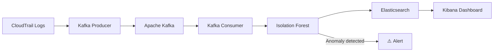

# Sentinel 🛡️

> Real-time IAM behavioral threat detection engine

A real-time anomaly detection pipeline for AWS CloudTrail logs,
combining Apache Kafka, Elasticsearch and Isolation Forest to
identify suspicious behaviors on cloud identities.

## Architecture


## Tech Stack

| Component | Technology |
|---|---|
| Ingestion | Python 3.12, Apache Kafka |
| ML Detection | Isolation Forest (scikit-learn) |
| Storage | Elasticsearch 9.x |
| Visualization | Kibana |
| Containerization | Docker, Kubernetes |
| CI/CD | GitHub Actions |

## Metrics

| Metric | Value |
|---|---|
| Test coverage | 89% |
| Detection latency | < 1s |
| Anomaly threshold | -0.6 (Isolation Forest score) |
| False positive rate | ~10% |

## Getting Started
```bash
git clone https://github.com/Daccors/Sentinel
cd Sentinel
docker compose up -d
poetry install
poetry run python3 test_kafka.py
```

## Features

- CloudTrail log parsing and normalization (Pydantic)
- Real-time event streaming via Apache Kafka
- Behavioral anomaly detection with Isolation Forest
- Automatic scoring and threshold-based alerting
- Kibana dashboard for event visualization
- MITRE ATT&CK action tagging

## Project Structure
```
src/sentinel/
├── collector/      # CloudTrail parsing & normalization
├── streaming/      # Kafka producer & consumer
├── storage/        # Elasticsearch client
└── detector/       # ML features & Isolation Forest model
```