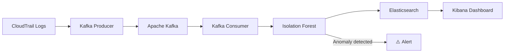

# CloudSentinel 🛡️

> Real-time IAM behavioral threat detection engine

A real-time anomaly detection pipeline for AWS CloudTrail logs,
combining Apache Kafka, Elasticsearch and Isolation Forest to
identify suspicious behaviors on cloud identities.

## Architecture


## Tech Stack

| Component | Technology |
|---|---|
| Ingestion | Python 3.12, Apache Kafka |
| ML Detection | Isolation Forest (scikit-learn) |
| Storage | Elasticsearch 9.x |
| Visualization | Kibana |
| Containerization | Docker, Kubernetes |
| Infrastructure | Terraform |
| CI/CD | GitHub Actions |

## Metrics

| Metric | Value |
|---|---|
| Test coverage | 89% |
| Detection latency | < 1s |
| Anomaly threshold | -0.6 (Isolation Forest score) |
| False positive rate | ~10% |

## Getting Started

## Getting Started
```bash
git clone https://github.com/Daccors/Sentinel
cd Sentinel
chmod +x deploy.sh
./deploy.sh
```

Choose your environment:
- `1` — Local development (Docker Compose + Kibana)
- `2` — Kubernetes (minikube)
- `3` — Kubernetes + Terraform (full IaC deployment)

## Features

- CloudTrail log parsing and normalization (Pydantic)
- Real-time event streaming via Apache Kafka
- Behavioral anomaly detection with Isolation Forest
- Automatic MITRE ATT&CK tagging (T1078, T1136, T1484)
- Automatic scoring and threshold-based alerting
- Kibana dashboard for event visualization
- 89% unit test coverage, CI/CD GitHub Actions
- SAST analysis with Semgrep, Docker image scanning with Trivy

## Security of the project itself

This project applies the same security principles it defends:

- No secrets hardcoded — environment variables via ConfigMap
- Non-root Docker image
- Automated vulnerability scanning (Trivy) on every push
- Static code analysis (Semgrep) on every push
- Strict `.gitignore` — no `.env` files committed

## Project Structure
```
src/sentinel/
├── collector/      # CloudTrail parsing & normalization
├── streaming/      # Kafka producer & consumer
├── storage/        # Elasticsearch client
└── detector/       # ML features & Isolation Forest model

deploy/
├── k8s/            # Kubernetes manifests
└── terraform/      # Terraform infrastructure as code

docs/
└── adr/            # Architecture Decision Records
```

## Architecture Decisions

Key architectural choices are documented in [`docs/adr/`](docs/adr/) :

- [ADR-001](docs/adr/001-kafka-vs-simple-queue.md) — Kafka vs Simple Queue
- [ADR-002](docs/adr/002-isolation-forest-vs-autoencoder.md) — Isolation Forest vs Autoencoder
- [ADR-003](docs/adr/003-elasticsearch-vs-postgresql.md) — Elasticsearch vs PostgreSQL
- [ADR-004](docs/adr/004-normalized-event-schema.md) — Normalized Event Schema